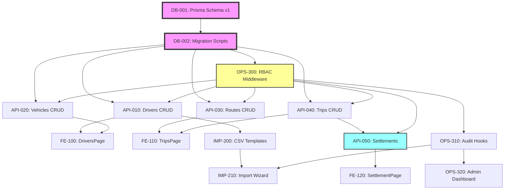

# 운송기사관리 시스템 (MVP) - 작업 분해 구조

**Version**: 1.0.0  
**작성일**: 2025-01-10  
**작성자**: Tech Lead  
**References**: [PLAN.md](./PLAN.md), [SPEC.md](./SPEC.md)

---

## Task Dependency Graph



---

## Database Tasks

### DB-001: Prisma Schema v1
**Priority**: P0 (Critical)  
**Owner**: Backend Lead  
**Estimated**: 8h

#### Inputs
- [SPEC.md Section 6](./SPEC.md#6-data-contracts-draft) - Data Contracts
- PostgreSQL 15 configuration
- Asia/Seoul timezone requirement

#### Steps
1. Create Prisma schema directory structure
2. Define enums in `commons.prisma`
   ```prisma
   enum VehicleOwnership {
     OWNED      // 고정
     CHARTER    // 용차
     CONSIGNED  // 지입
   }
   enum TripStatus {
     SCHEDULED
     COMPLETED
     ABSENCE
     SUBSTITUTE
   }
   enum SettlementStatus {
     DRAFT
     CONFIRMED
     PAID
   }
   ```
3. Create domain schemas:
   - `auth.prisma`: User, Session, Role
   - `driver.prisma`: Driver, Vehicle
   - `route.prisma`: RouteTemplate
   - `trip.prisma`: Trip
   - `settlement.prisma`: Settlement, SettlementItem
   - `audit.prisma`: AuditLog
4. Define relationships and constraints
5. Add indexes for performance:
   - `@@index([driverId, date])` on Trip
   - `@@index([yearMonth, driverId])` on Settlement
   - `@@unique([plateNumber, date, driverId])` on Trip

#### Artifacts
- `/prisma/schema/*.prisma` files
- Schema documentation
- ER diagram

#### Tests
- [ ] Schema validation: `npx prisma validate`
- [ ] Foreign key relationships correct
- [ ] Unique constraints working
- [ ] Timezone handling (timestamptz)

#### Rollback
- Previous schema backup in `/prisma/backup/`
- Migration rollback command ready

---

### DB-002: Migration Scripts
**Priority**: P0 (Critical)  
**Owner**: Backend Lead  
**Estimated**: 4h  
**Dependencies**: DB-001

#### Inputs
- Completed Prisma schemas
- Seed data requirements

#### Steps
1. Generate initial migration
   ```bash
   npx prisma migrate dev --name init
   ```
2. Create seed script `/prisma/seed.ts`
   - Admin user
   - Sample drivers (10)
   - Sample vehicles (10)
   - Sample routes (5)
3. Create reset script `/scripts/db-reset.sh`
   ```bash
   #!/bin/bash
   npx prisma migrate reset --force
   npx prisma db seed
   ```
4. Create backup script `/scripts/db-backup.sh`

#### Artifacts
- `/prisma/migrations/` directory
- `/prisma/seed.ts`
- `/scripts/db-*.sh` scripts

#### Tests
- [ ] Migration applies cleanly
- [ ] Seed data loads correctly
- [ ] Reset script works
- [ ] Backup/restore verified

#### Rollback
- `npx prisma migrate reset`
- Restore from backup

---

## API Tasks

### API-010: Drivers CRUD + Zod Schema
**Priority**: P0 (Critical)  
**Owner**: Backend Dev 1  
**Estimated**: 8h  
**Dependencies**: DB-002, OPS-300

#### Inputs
- Driver schema from DB-001
- [SPEC.md Section 7.1](./SPEC.md#71-역할별-권한-매트릭스) - RBAC matrix

#### Steps
1. Create Zod validation schemas
   ```typescript
   // lib/validations/driver.ts
   export const driverSchema = z.object({
     name: z.string().min(2).max(50),
     phone: z.string().regex(/^01[0-9]-\d{4}-\d{4}$/),
     email: z.string().email().optional(),
     businessNumber: z.string().regex(/^\d{3}-\d{2}-\d{5}$/).optional(),
     bankAccount: z.string().optional()
   });
   ```
2. Implement service layer `/lib/services/driver.service.ts`
3. Create API routes:
   - `GET /api/drivers` - List with pagination
   - `GET /api/drivers/:id` - Get single
   - `POST /api/drivers` - Create (admin, dispatcher)
   - `PUT /api/drivers/:id` - Update (admin, dispatcher)
   - `DELETE /api/drivers/:id` - Soft delete (admin only)
4. Error handling policy:
   - 400: Validation errors
   - 401: Unauthorized
   - 403: Forbidden (RBAC)
   - 404: Not found
   - 409: Duplicate (phone/businessNumber)
   - 500: Server error

#### Artifacts
- `/app/api/drivers/route.ts`
- `/app/api/drivers/[id]/route.ts`
- `/lib/services/driver.service.ts`
- `/lib/validations/driver.ts`

#### Tests
- [ ] CRUD operations work
- [ ] Validation rejects invalid data
- [ ] RBAC prevents unauthorized access
- [ ] Duplicate phone number rejected
- [ ] Soft delete preserves data

#### Rollback
- Revert API route files
- Restore previous service version

---

### API-020: Vehicles CRUD
**Priority**: P1 (High)  
**Owner**: Backend Dev 1  
**Estimated**: 6h  
**Dependencies**: DB-002, API-010, OPS-300

#### Inputs
- Vehicle schema with ownership enum
- Driver-Vehicle relationship

#### Steps
1. Create Zod schema with ownership validation
   ```typescript
   export const vehicleSchema = z.object({
     plateNumber: z.string().regex(/^\d{2,3}[가-힣]\d{4}$/),
     vehicleType: z.enum(['1톤', '2.5톤', '5톤', '11톤']),
     ownership: z.enum(['OWNED', 'CHARTER', 'CONSIGNED']),
     driverId: z.string().uuid().optional()
   });
   ```
2. Implement vehicle service with:
   - Driver assignment validation (1:1)
   - Ownership change tracking
3. Create API routes with RBAC:
   - Only admin can create/update/delete vehicles
   - All roles can read

#### Artifacts
- `/app/api/vehicles/route.ts`
- `/app/api/vehicles/[id]/route.ts`
- `/lib/services/vehicle.service.ts`

#### Tests
- [ ] Vehicle CRUD operations
- [ ] Ownership enum validation
- [ ] Driver assignment (1:1 constraint)
- [ ] Plate number uniqueness
- [ ] RBAC enforcement

#### Rollback
- Revert vehicle-related files
- Remove vehicle-driver relationships

---

### API-030: Routes CRUD
**Priority**: P1 (High)  
**Owner**: Backend Dev 2  
**Estimated**: 8h  
**Dependencies**: DB-002, OPS-300

#### Inputs
- RouteTemplate schema
- Weekday pattern requirements (0-6)
- Fare pair (driverFare, billingFare)

#### Steps
1. Create route validation schema
   ```typescript
   export const routeSchema = z.object({
     name: z.string().min(3).max(100),
     loadingPoint: z.string(),
     unloadingPoint: z.string(),
     distance: z.number().positive().optional(),
     driverFare: z.number().nonnegative(),
     billingFare: z.number().nonnegative(),
     weekdayPattern: z.array(z.number().min(0).max(6)),
     defaultDriverId: z.string().uuid().optional()
   });
   ```
2. Implement route service with:
   - Weekday mask validation
   - Fare validation (billing >= driver)
   - Auto trip generation for month
3. Create endpoints:
   - Standard CRUD
   - `POST /api/routes/generate-trips` - Generate monthly trips

#### Artifacts
- `/app/api/routes/route.ts`
- `/app/api/routes/[id]/route.ts`
- `/app/api/routes/generate-trips/route.ts`
- `/lib/services/route.service.ts`

#### Tests
- [ ] Route CRUD operations
- [ ] Weekday pattern validation (0-6)
- [ ] Fare pair validation
- [ ] Monthly trip generation
- [ ] Duplicate route name handling

#### Rollback
- Remove generated trips
- Revert route files

---

### API-040: Trips CRUD
**Priority**: P0 (Critical)  
**Owner**: Backend Dev 2  
**Estimated**: 10h  
**Dependencies**: DB-002, API-010, API-030, OPS-300

#### Inputs
- Trip schema with status enum
- Absence/substitute handling rules
- Uniqueness constraint (plate+date+driver)

#### Steps
1. Create comprehensive trip validation
   ```typescript
   export const tripSchema = z.object({
     date: z.string().regex(/^\d{4}-\d{2}-\d{2}$/),
     driverId: z.string().uuid(),
     vehicleId: z.string().uuid(),
     routeTemplateId: z.string().uuid().optional(),
     status: z.enum(['SCHEDULED', 'COMPLETED', 'ABSENCE', 'SUBSTITUTE']),
     // Absence fields
     absenceReason: z.string().optional(),
     deductionAmount: z.number().optional(),
     // Substitute fields
     substituteDriverId: z.string().uuid().optional(),
     substituteFare: z.number().optional(),
     // Custom route
     customRoute: z.object({
       loadingPoint: z.string(),
       unloadingPoint: z.string(),
       description: z.string()
     }).optional()
   });
   ```
2. Implement trip service with:
   - Duplicate validation (plate+date+driver)
   - Absence deduction calculation (10%)
   - Substitute fare handling (5% + substitute cost)
   - Status transition rules
3. Create bulk operations:
   - `POST /api/trips/bulk-update` - Update multiple trips
   - `POST /api/trips/bulk-status` - Change status for date range

#### Artifacts
- `/app/api/trips/route.ts`
- `/app/api/trips/[id]/route.ts`
- `/app/api/trips/bulk-update/route.ts`
- `/lib/services/trip.service.ts`

#### Tests
- [ ] Trip CRUD with all statuses
- [ ] Duplicate constraint enforced
- [ ] Absence deduction calculated correctly
- [ ] Substitute driver assignment
- [ ] Bulk operations work
- [ ] Date range queries

#### Rollback
- Restore trips to previous state
- Revert calculation changes

---

### API-050: Settlements API
**Priority**: P0 (Critical)  
**Owner**: Backend Lead  
**Estimated**: 12h  
**Dependencies**: API-040

#### Inputs
- Settlement calculation rules from [SPEC.md Section 5.2](./SPEC.md#52-정산-계산-규칙)
- Lock mechanism requirements

#### Steps
1. Create settlement validation
   ```typescript
   export const settlementSchema = z.object({
     yearMonth: z.string().regex(/^\d{4}-\d{2}$/),
     driverId: z.string().uuid(),
     adjustments: z.array(z.object({
       type: z.enum(['ADDITION', 'DEDUCTION']),
       description: z.string(),
       amount: z.number()
     })).optional()
   });
   ```
2. Implement settlement service:
   ```typescript
   class SettlementService {
     async preview(driverId: string, yearMonth: string) {
       // Calculate without saving
     }
     async create(driverId: string, yearMonth: string) {
       // Create DRAFT settlement
     }
     async confirm(settlementId: string) {
       // Lock settlement, prevent changes
     }
     async exportExcel(settlementId: string) {
       // Generate Excel file
     }
   }
   ```
3. Create settlement endpoints:
   - `GET /api/settlements` - List settlements
   - `POST /api/settlements` - Create draft
   - `GET /api/settlements/:id/preview` - Preview calculation
   - `POST /api/settlements/:id/confirm` - Confirm & lock
   - `GET /api/settlements/:id/export` - Excel download

#### Artifacts
- `/app/api/settlements/route.ts`
- `/app/api/settlements/[id]/route.ts`
- `/app/api/settlements/[id]/preview/route.ts`
- `/app/api/settlements/[id]/confirm/route.ts`
- `/app/api/settlements/[id]/export/route.ts`
- `/lib/services/settlement.service.ts`

#### Tests
- [ ] Settlement calculation accuracy
- [ ] Preview matches final
- [ ] Confirm locks data
- [ ] Cannot modify confirmed settlement
- [ ] Excel export works
- [ ] Month boundary calculations

#### Rollback
- Unlock settlements
- Restore calculation logic

---

## Frontend Tasks

### FE-100: DriversPage with DB Integration
**Priority**: P1 (High)  
**Owner**: Frontend Dev 1  
**Estimated**: 10h  
**Dependencies**: API-010, API-020

#### Inputs
- Driver API endpoints
- Vehicle assignment requirements
- UI/UX mockups

#### Steps
1. Create driver list page with DataTable
   ```typescript
   // app/drivers/page.tsx
   export default function DriversPage() {
     const { data: drivers } = useQuery({
       queryKey: ['drivers'],
       queryFn: fetchDrivers
     });
     // DataTable with sorting, filtering, pagination
   }
   ```
2. Implement driver form modal:
   - Create/Edit modes
   - Form validation with react-hook-form
   - Vehicle assignment dropdown
3. Add optimistic updates:
   ```typescript
   const mutation = useMutation({
     mutationFn: updateDriver,
     onMutate: async (newDriver) => {
       await queryClient.cancelQueries(['drivers']);
       const previous = queryClient.getQueryData(['drivers']);
       queryClient.setQueryData(['drivers'], old => 
         old.map(d => d.id === newDriver.id ? newDriver : d)
       );
       return { previous };
     },
     onError: (err, newDriver, context) => {
       queryClient.setQueryData(['drivers'], context.previous);
     }
   });
   ```
4. Add search/filter functionality
5. Implement soft delete with confirmation

#### Artifacts
- `/app/drivers/page.tsx`
- `/app/drivers/layout.tsx`
- `/components/drivers/DriverTable.tsx`
- `/components/drivers/DriverModal.tsx`
- `/hooks/useDrivers.ts`

#### Tests
- [ ] Driver list loads and displays
- [ ] Create driver works
- [ ] Edit driver updates optimistically
- [ ] Delete shows confirmation
- [ ] Search/filter works
- [ ] Vehicle assignment dropdown populated

#### Rollback
- Restore previous page version
- Clear optimistic cache

---

### FE-110: TripsPage with Calendar/Table Toggle
**Priority**: P1 (High)  
**Owner**: Frontend Dev 2  
**Estimated**: 12h  
**Dependencies**: API-040

#### Inputs
- Trip API endpoints
- Calendar view requirements
- Drag-drop assignment needs

#### Steps
1. Create trip page with view toggle
   ```typescript
   export default function TripsPage() {
     const [view, setView] = useState<'calendar' | 'table'>('calendar');
     const [selectedDate, setSelectedDate] = useState(new Date());
     
     return view === 'calendar' 
       ? <TripCalendar date={selectedDate} />
       : <TripTable date={selectedDate} />;
   }
   ```
2. Implement calendar view:
   - Monthly calendar grid
   - Trip count badges per day
   - Status color coding
3. Implement table view:
   - Daily trips list
   - Inline status editing
   - Bulk selection
4. Add drag-drop for quick assignment:
   ```typescript
   const handleDrop = (tripId: string, driverId: string) => {
     updateTrip({ id: tripId, driverId });
   };
   ```
5. Quick actions:
   - Mark absence/substitute
   - Assign substitute driver
   - Add deduction

#### Artifacts
- `/app/trips/page.tsx`
- `/components/trips/TripCalendar.tsx`
- `/components/trips/TripTable.tsx`
- `/components/trips/QuickAssign.tsx`
- `/hooks/useTrips.ts`

#### Tests
- [ ] Calendar/table toggle works
- [ ] Calendar shows trip counts
- [ ] Table allows inline editing
- [ ] Drag-drop assignment works
- [ ] Status updates reflect immediately
- [ ] Date navigation works

#### Rollback
- Restore previous trip management
- Reset trip assignments

---

### FE-120: SettlementPage with Preview/Export
**Priority**: P0 (Critical)  
**Owner**: Frontend Dev 1  
**Estimated**: 10h  
**Dependencies**: API-050

#### Inputs
- Settlement API endpoints
- Excel export requirements
- Preview UI mockups

#### Steps
1. Create settlement page structure
   ```typescript
   export default function SettlementPage() {
     const [yearMonth, setYearMonth] = useState(getCurrentYearMonth());
     const [selectedDriver, setSelectedDriver] = useState(null);
     
     return (
       <>
         <SettlementFilters 
           yearMonth={yearMonth}
           onYearMonthChange={setYearMonth}
         />
         <SettlementList yearMonth={yearMonth} />
         {selectedDriver && (
           <SettlementPreview 
             driverId={selectedDriver}
             yearMonth={yearMonth}
           />
         )}
       </>
     );
   }
   ```
2. Implement preview modal:
   - Trip summary table
   - Deduction details
   - Final calculation
   - Manual adjustments
3. Add confirmation flow:
   ```typescript
   const confirmSettlement = async (settlementId: string) => {
     if (!confirm('정산을 확정하시겠습니까?')) return;
     await api.confirmSettlement(settlementId);
     toast.success('정산이 확정되었습니다');
   };
   ```
4. Implement Excel export:
   ```typescript
   const exportExcel = async (settlementId: string) => {
     const blob = await api.exportSettlement(settlementId);
     downloadBlob(blob, `settlement-${yearMonth}.xlsx`);
   };
   ```

#### Artifacts
- `/app/settlements/page.tsx`
- `/components/settlements/SettlementList.tsx`
- `/components/settlements/SettlementPreview.tsx`
- `/components/settlements/SettlementConfirm.tsx`
- `/hooks/useSettlements.ts`

#### Tests
- [ ] Settlement list displays
- [ ] Preview calculations correct
- [ ] Manual adjustments work
- [ ] Confirmation locks settlement
- [ ] Excel export downloads
- [ ] Cannot edit confirmed settlements

#### Rollback
- Unlock settlements if needed
- Restore previous calculations

---

## Import Tasks

### IMP-200: CSV Templates
**Priority**: P2 (Medium)  
**Owner**: Backend Dev 1  
**Estimated**: 4h  
**Dependencies**: API-010

#### Inputs
- Data models from DB-001
- Field requirements from SPEC.md

#### Steps
1. Create driver template `/public/templates/drivers.csv`
   ```csv
   이름*,연락처*,차량번호,사업자번호,상호명,대표자명,은행명,계좌번호,비고
   홍길동,010-1234-5678,12가3456,123-45-67890,길동운송,홍길동,국민은행,123-456-789012,
   ```
2. Create vehicle template `/public/templates/vehicles.csv`
   ```csv
   차량번호*,차종*,톤수,소유구분*,배정기사
   12가3456,탑차,2.5,고정,홍길동
   ```
3. Create route template `/public/templates/routes.csv`
   ```csv
   노선명*,상차지*,하차지*,거리(km),기사운임*,청구운임*,운행요일,기본기사
   서울-부산,서울물류센터,부산항,450,250000,300000,"월,수,금",홍길동
   ```
4. Create trip template `/public/templates/trips.csv`
   ```csv
   운행일*,기사명*,차량번호*,노선명,상태,기사운임,청구운임,비고
   2025-01-10,홍길동,12가3456,서울-부산,완료,250000,300000,
   ```
5. Add download endpoint `/api/templates/:type`

#### Artifacts
- `/public/templates/*.csv` files
- `/app/api/templates/[type]/route.ts`
- Template documentation

#### Tests
- [ ] Templates have correct headers
- [ ] Required fields marked with *
- [ ] Sample data included
- [ ] Downloads work
- [ ] Encoding is UTF-8 with BOM

#### Rollback
- Remove template files
- Restore previous templates

---

### IMP-210: Import Wizard
**Priority**: P1 (High)  
**Owner**: Full-stack Dev  
**Estimated**: 16h  
**Dependencies**: IMP-200, OPS-310

#### Inputs
- CSV templates
- Validation rules
- Mapping requirements

#### Steps
1. Create import wizard component
   ```typescript
   export function ImportWizard() {
     const [step, setStep] = useState(1);
     const [file, setFile] = useState(null);
     const [mapping, setMapping] = useState({});
     const [validation, setValidation] = useState(null);
     
     return (
       <WizardSteps current={step}>
         <UploadStep onUpload={setFile} />
         <MappingStep 
           file={file}
           mapping={mapping}
           onMapping={setMapping}
         />
         <ValidationStep 
           validation={validation}
           onValidate={validate}
         />
         <CommitStep onCommit={commit} />
       </WizardSteps>
     );
   }
   ```
2. Implement file parser:
   ```typescript
   import Papa from 'papaparse';
   
   const parseCSV = (file: File) => {
     return new Promise((resolve) => {
       Papa.parse(file, {
         header: true,
         encoding: 'UTF-8',
         complete: (results) => resolve(results)
       });
     });
   };
   ```
3. Create column mapper:
   - Auto-detect mappings
   - Manual override
   - Save mapping profiles
4. Implement validation:
   - Required fields check
   - Format validation
   - Duplicate detection
   - Reference validation
5. Add simulation mode:
   - Show what will be created/updated
   - Highlight conflicts
   - Allow selective import

#### Artifacts
- `/components/import/ImportWizard.tsx`
- `/components/import/UploadStep.tsx`
- `/components/import/MappingStep.tsx`
- `/components/import/ValidationStep.tsx`
- `/components/import/CommitStep.tsx`
- `/lib/utils/csv-parser.ts`
- `/lib/services/import.service.ts`

#### Tests
- [ ] File upload accepts CSV
- [ ] Auto-mapping works
- [ ] Validation catches errors
- [ ] Simulation shows preview
- [ ] Commit imports data
- [ ] Audit log created

#### Rollback
- Rollback imported data
- Restore from audit log

---

## Operations Tasks

### OPS-300: RBAC Middleware
**Priority**: P0 (Critical)  
**Owner**: Backend Lead  
**Estimated**: 8h  
**Dependencies**: DB-002

#### Inputs
- Role matrix from [SPEC.md Section 7.1](./SPEC.md#71-역할별-권한-매트릭스)
- NextAuth.js configuration

#### Steps
1. Extend NextAuth session
   ```typescript
   // lib/auth/config.ts
   declare module "next-auth" {
     interface Session {
       user: {
         id: string;
         email: string;
         name: string;
         role: 'ADMIN' | 'DISPATCHER' | 'ACCOUNTANT';
       }
     }
   }
   ```
2. Create RBAC middleware
   ```typescript
   // middleware.ts
   export function withAuth(
     handler: NextApiHandler,
     allowedRoles: UserRole[]
   ) {
     return async (req, res) => {
       const session = await getServerSession(req, res, authOptions);
       if (!session) {
         return res.status(401).json({ error: 'Unauthorized' });
       }
       if (!allowedRoles.includes(session.user.role)) {
         return res.status(403).json({ error: 'Forbidden' });
       }
       return handler(req, res);
     };
   }
   ```
3. Apply to all API routes:
   ```typescript
   // Example usage
   export const GET = withAuth(
     async (req, res) => { /* handler */ },
     ['ADMIN', 'DISPATCHER']
   );
   ```
4. Create permission helper
   ```typescript
   export const permissions = {
     drivers: {
       create: ['ADMIN', 'DISPATCHER'],
       read: ['ADMIN', 'DISPATCHER', 'ACCOUNTANT'],
       update: ['ADMIN', 'DISPATCHER'],
       delete: ['ADMIN']
     }
   };
   ```

#### Artifacts
- `/middleware.ts`
- `/lib/auth/rbac.ts`
- `/lib/auth/permissions.ts`
- Updated API routes with RBAC

#### Tests
- [ ] Admin can access all endpoints
- [ ] Dispatcher has correct permissions
- [ ] Accountant limited to read + settlement
- [ ] Unauthorized returns 401
- [ ] Forbidden returns 403

#### Rollback
- Remove middleware
- Restore open access (dev only)

---

### OPS-310: Audit Log Hooks
**Priority**: P1 (High)  
**Owner**: Backend Dev 2  
**Estimated**: 6h  
**Dependencies**: OPS-300, IMP-210

#### Inputs
- Audit log schema
- Events to track

#### Steps
1. Create audit service
   ```typescript
   // lib/services/audit.service.ts
   export class AuditService {
     async log(event: AuditEvent) {
       await prisma.auditLog.create({
         data: {
           userId: event.userId,
           userName: event.userName,
           action: event.action,
           entityType: event.entityType,
           entityId: event.entityId,
           changes: event.changes,
           metadata: {
             ip: event.ip,
             userAgent: event.userAgent,
             ...event.metadata
           }
         }
       });
     }
   }
   ```
2. Create Prisma middleware for auto-logging
   ```typescript
   prisma.$use(async (params, next) => {
     const result = await next(params);
     
     if (['create', 'update', 'delete'].includes(params.action)) {
       await auditService.log({
         action: params.action,
         entityType: params.model,
         entityId: result.id,
         changes: params.args
       });
     }
     
     return result;
   });
   ```
3. Add import audit logging:
   ```typescript
   // Special handling for bulk imports
   await auditService.log({
     action: 'IMPORT',
     entityType: 'Driver',
     metadata: {
       fileName: file.name,
       recordCount: records.length,
       created: created.length,
       updated: updated.length
     }
   });
   ```
4. Create audit viewer API
   ```typescript
   export const GET = withAuth(
     async (req) => {
       const logs = await prisma.auditLog.findMany({
         orderBy: { createdAt: 'desc' },
         take: 100
       });
       return Response.json(logs);
     },
     ['ADMIN']
   );
   ```

#### Artifacts
- `/lib/services/audit.service.ts`
- `/lib/prisma/audit-middleware.ts`
- `/app/api/audit/route.ts`

#### Tests
- [ ] CRUD operations logged
- [ ] Import events logged
- [ ] Settlement confirmation logged
- [ ] User info captured
- [ ] Metadata recorded

#### Rollback
- Disable audit middleware
- Preserve existing logs

---

### OPS-320: Admin Dashboard
**Priority**: P2 (Medium)  
**Owner**: Full-stack Dev  
**Estimated**: 8h  
**Dependencies**: OPS-310

#### Inputs
- Metrics requirements
- Health check needs
- Dashboard mockups

#### Steps
1. Create dashboard layout
   ```typescript
   export default function AdminDashboard() {
     return (
       <div className="grid grid-cols-2 gap-4">
         <MetricCard title="일일 운행" value={metrics.dailyTrips} />
         <MetricCard title="활성 기사" value={metrics.activeDrivers} />
         <MetricCard title="정산 대기" value={metrics.pendingSettlements} />
         <MetricCard title="시스템 상태" value={health.status} />
       </div>
     );
   }
   ```
2. Create metrics API
   ```typescript
   export const GET = withAuth(
     async () => {
       const metrics = await calculateMetrics();
       return Response.json({
         dailyTrips: metrics.dailyTrips,
         activeDrivers: metrics.activeDrivers,
         pendingSettlements: metrics.pendingSettlements,
         importSuccessRate: metrics.importSuccessRate,
         systemUptime: process.uptime()
       });
     },
     ['ADMIN']
   );
   ```
3. Implement health checks
   ```typescript
   export async function healthCheck() {
     const checks = {
       database: await checkDatabase(),
       redis: await checkRedis(),
       storage: await checkStorage(),
       memory: process.memoryUsage()
     };
     
     return {
       status: Object.values(checks).every(c => c.healthy) ? 'healthy' : 'degraded',
       checks
     };
   }
   ```
4. Add audit log viewer
5. Create system settings page

#### Artifacts
- `/app/admin/dashboard/page.tsx`
- `/app/admin/audit/page.tsx`
- `/app/admin/settings/page.tsx`
- `/app/api/dashboard/metrics/route.ts`
- `/app/api/dashboard/health/route.ts`

#### Tests
- [ ] Dashboard loads for admin
- [ ] Metrics display correctly
- [ ] Health check works
- [ ] Audit logs viewable
- [ ] Non-admin cannot access

#### Rollback
- Remove admin pages
- Disable metrics collection

---

## Task Checklist

### Week 1 Sprint (Foundation)
- [ ] DB-001: Prisma Schema v1
- [ ] DB-002: Migration Scripts
- [ ] OPS-300: RBAC Middleware
- [ ] IMP-200: CSV Templates

### Week 2 Sprint (Core CRUD)
- [ ] API-010: Drivers CRUD
- [ ] API-020: Vehicles CRUD
- [ ] API-030: Routes CRUD
- [ ] API-040: Trips CRUD
- [ ] FE-100: DriversPage

### Week 3 Sprint (Settlement & UI)
- [ ] API-050: Settlements API
- [ ] FE-110: TripsPage
- [ ] FE-120: SettlementPage
- [ ] OPS-310: Audit Log Hooks

### Week 4 Sprint (Import & Polish)
- [ ] IMP-210: Import Wizard
- [ ] OPS-320: Admin Dashboard
- [ ] Integration Testing
- [ ] Performance Optimization
- [ ] Documentation

---

## Risk Mitigation per Task

| Task | Risk | Mitigation |
|------|------|------------|
| DB-001 | Schema changes | Version control, migrations |
| API-040 | Complex validation | Comprehensive tests |
| API-050 | Calculation errors | Unit tests, Excel comparison |
| FE-110 | Performance issues | Virtual scrolling, pagination |
| IMP-210 | Data corruption | Validation, rollback capability |
| OPS-300 | Security holes | Penetration testing |

---

## Success Metrics

### Code Quality
- [ ] 80% test coverage
- [ ] No critical security issues
- [ ] TypeScript strict mode
- [ ] ESLint no errors

### Performance
- [ ] API response < 200ms (P95)
- [ ] Page load < 2s
- [ ] Settlement calculation < 5s
- [ ] Import 1000 records < 10s

### Business
- [ ] All CRUD operations working
- [ ] Settlement accuracy 100%
- [ ] Import success rate > 95%
- [ ] Audit trail complete

---

**END OF TASKS**

_Tasks will be tracked in project management tool and updated daily during standup._